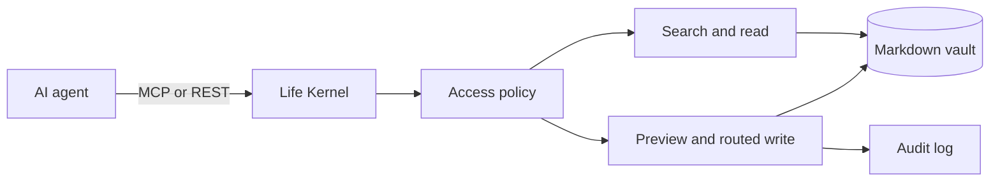

<p align="center">
  
</p>

<h1 align="center">Life Kernel</h1>

<p align="center"><strong>Your life and project context, owned by you and usable by any AI agent.</strong></p>

<p align="center">
  <a href="LICENSE"></a>
  
  
</p>

Life Kernel is a self-hosted context layer built on ordinary Markdown folders. It gives AI agents a small, auditable interface for finding notes, reading source-backed context, and recording completed work without unrestricted filesystem access.

It combines an Obsidian-compatible starter vault, constrained write routes, local and remote MCP transports, and reusable agent skills. Your Markdown remains the source of truth.

> [!IMPORTANT]
> Life Kernel is an early single-user developer preview. Local stdio is the recommended mode. Remote HTTP should be deployed privately behind TLS and requires a bearer token.

## How it works



- **Markdown-native:** use ordinary folders and files with Obsidian or any editor.
- **Agent-ready:** connect through MCP over stdio or authenticated Streamable HTTP.
- **Source-backed:** search results include file, line, and SHA-256 provenance.
- **Controlled writes:** routes, previews, request IDs, expected hashes, and audit events guard mutations.
- **Portable behavior:** skills define onboarding, the morning plan, the daily circle, weekly, monthly, and quarterly reviews, and project memory.
- **Rituals that keep their rhythm:** the server knows when each ritual is due and what it should cover, so every connected agent can offer it at the right time. Optional reminders reach your phone (ntfy), desktop, webhook, or calendar.

## Quick start

Requirements: Node.js 22+ and npm.

```bash
git clone https://github.com/poyrazavsever/Life-Kernel.git
cd Life-Kernel
npm install
npm run build
npm run cli -- init ./vaults/personal
npm run cli -- doctor
```

`init` copies the starter vault and, when no `lifekernel.config.json` exists, writes one for it with your computer's time zone. Secrets such as tokens and the ntfy topic go in a `.env` file next to the config (see `.env.example`); every entry point reads it.

Start a local MCP server:

```bash
LIFEKERNEL_CONFIG=./lifekernel.config.json npm run dev:stdio
```

Connect Claude Desktop, Claude Code, or Codex with `npm run cli -- connect <client>` (see [clients](docs/clients.md)).

Start the authenticated HTTP server:

```bash
LIFEKERNEL_API_TOKEN='use-a-long-random-token' npm run dev:http
```

The HTTP server exposes `/mcp` and a small REST surface under `/v1`. Continue with [agent integration](docs/agent-integration.md) or [self-hosting](docs/self-hosting.md).

## What agents can do

- list configured vaults;
- search Markdown with file, line, and SHA-256 provenance;
- read one safe relative Markdown path while enforcing `ai_access`;
- fetch a bounded session context bundle and find backlinks;
- look up the single daily, weekly, monthly, or quarterly note for a date;
- list notes by type, status, or area, and collect open tasks by due date;
- see which rituals (morning plan, daily circle, weekly, monthly, and quarterly reviews) are due, and get each one's agenda;
- preview a routed create, append, section update, or frontmatter change;
- apply the exact request idempotently;
- validate required frontmatter and inspect recent audit events.

Life Kernel v0.1 does not expose arbitrary shell access, delete, move, or unrestricted path writes.

## Repository map

```text
apps/cli                 local setup and maintenance commands
apps/mcp                 stdio MCP, HTTP MCP, and REST API
packages/core            vault, search, write, policy, and audit core
skills/                  reusable behavior instructions for agents
templates/starter-vault  generic Obsidian-compatible starting point
docs/                    architecture, operations, and brand guides
assets/brand             canonical visual identity assets
```

## Documentation

- [Architecture](docs/architecture.md)
- [Vault specification](docs/vault-spec.md)
- [Connecting clients](docs/clients.md)
- [Agent integration](docs/agent-integration.md)
- [Self-hosting](docs/self-hosting.md)
- [Security model](docs/security-model.md)
- [Skills](docs/skills.md)
- [Ritual reminders](docs/notifications.md)
- [Brand guide](docs/brand.md)
- [Roadmap](docs/roadmap.md)

## Principles

1. Markdown remains the source of truth.
2. The user owns storage and chooses every mounted vault.
3. Search results carry their source and content hash.
4. Writes are routed, previewable, idempotent, conflict-aware, and audited.
5. Skills decide how to work; MCP supplies constrained capabilities.

## Contributing

See [CONTRIBUTING.md](CONTRIBUTING.md) for local development guidance. Security issues should follow [SECURITY.md](SECURITY.md).

## License

MIT. See [LICENSE](LICENSE).
