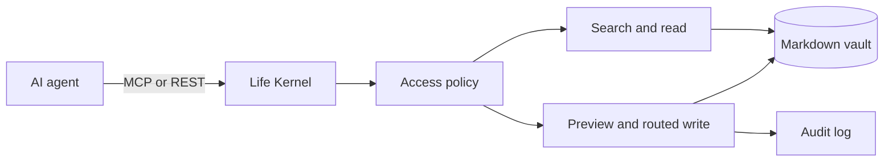

<p align="center">
  
</p>

<h1 align="center">Life Kernel</h1>

<p align="center"><strong>Your life and project context, owned by you and usable by any AI agent.</strong></p>

<p align="center">
  <a href="LICENSE"></a>
  
  
</p>

https://github.com/user-attachments/assets/7b79272d-fe93-4ea8-842d-a32584227662

Life Kernel turns a folder of Markdown notes into the shared memory behind your planning with AI. You talk to Claude, ChatGPT, or Codex for about fifteen minutes each evening; the agent records how the day went, updates tomorrow's plan, and keeps a trail of what you decided and when. Once a week it reviews the week against the capacity you actually showed, and monthly and quarterly reviews keep the larger goals honest. You choose the planning method during onboarding; nothing is imposed.

Underneath, it is a self-hosted context layer built on ordinary Markdown folders and an Obsidian-compatible starter vault. Agents get a small, auditable interface for finding notes, reading source-backed context, and recording completed work through constrained write routes, without unrestricted filesystem access. MCP (local or remote), REST, and a CLI reach the same vault, and reusable skills carry the behavior to every client. Your Markdown remains the source of truth.

> [!IMPORTANT]
> Life Kernel is an early single-user beta. Local stdio is the recommended mode. Remote HTTP, which ChatGPT and Claude.ai need, should be deployed privately behind TLS; it signs in with OAuth or a bearer token. The OAuth flow is covered by automated tests and has been used live with Claude.ai; ChatGPT has not been verified yet.

## How it works



- **Markdown-native:** use ordinary folders and files with Obsidian or any editor.
- **Agent-ready:** connect through MCP over stdio or authenticated Streamable HTTP.
- **Source-backed:** search results include file, line, and SHA-256 provenance.
- **Controlled writes:** routes, previews, request IDs, expected hashes, and audit events guard mutations.
- **Portable behavior:** skills define onboarding, the morning plan, the daily circle, weekly, monthly, and quarterly reviews, and project memory.
- **One hub, many agents:** personal, startup, and work vaults side by side; each client sees only the vaults it was granted, writes are named per agent, and a git-backed vault can undo a write.
- **Rituals that keep their rhythm:** the server knows when each ritual is due and what it should cover, so every connected agent can offer it at the right time. Optional reminders reach your phone (ntfy or Telegram, with snooze and skip buttons), desktop, email, webhook, or calendar, and you can capture a thought into the inbox from Telegram, a phone shortcut, or the CLI.

## Quick start

The [quick-start guide](docs/quickstart.md) walks through both paths: five minutes on your computer for Claude Desktop, Claude Code, Codex, and other desktop clients, or about thirty minutes to reach Claude.ai or ChatGPT, and then what the first conversation and each day look like. The short version, on your computer:

Requirements: Node.js 22+ and npm.
```bash
git clone https://github.com/poyrazavsever/Life-Kernel.git
cd Life-Kernel
npm install
npm run build
npm run cli -- init ./vaults/personal
npm run cli -- doctor
```

`init` copies the starter vault and, when no `lifekernel.config.json` exists, writes one for it with your computer's time zone. Secrets such as tokens and the ntfy topic go in a `.env` file next to the config (see `.env.example`); every entry point reads it.

Start a local MCP server:

```bash
LIFEKERNEL_CONFIG=./lifekernel.config.json npm run dev:stdio
```

Connect Claude Desktop, Claude Code, or Codex with `npm run cli -- connect <client>` (see [clients](docs/clients.md)).

Start the authenticated HTTP server:

```bash
LIFEKERNEL_API_TOKEN='use-a-long-random-token' npm run dev:http
```

The HTTP server exposes `/mcp` and a small REST surface under `/v1`. Continue with [agent integration](docs/agent-integration.md) or [self-hosting](docs/self-hosting.md).

## What agents can do

- list configured vaults;
- search Markdown with file, line, and SHA-256 provenance;
- read one safe relative Markdown path while enforcing `ai_access`;
- fetch a bounded session context bundle and find backlinks;
- look up the single daily, weekly, monthly, or quarterly note for a date;
- list notes by type, status, or area, and collect open tasks by due date;
- see which rituals (morning plan, daily circle, weekly, monthly, and quarterly reviews) are due, and get each one's agenda;
- measure a week, month, or quarter: energy patterns, focus against capacity, ritual consistency, and tasks carried day after day;
- preview a routed create, append, section update, or frontmatter change;
- apply the exact request idempotently;
- validate required frontmatter and inspect recent audit events.

Life Kernel never exposes shell access, delete, rename, or writes outside a configured route. When a vault keeps git history, the owner can undo a write from the CLI with `lifekernel undo`.

## Repository map

```text
apps/cli                 setup, reminders, capture, tokens, and maintenance commands
apps/mcp                 stdio MCP, HTTP MCP, OAuth, and REST API
packages/core            vault, search, write, policy, rituals, reminders, and audit core
skills/                  reusable behavior instructions for agents
templates/               starter-vault (personal), startup-vault, and work-vault
deploy/                  reverse proxy example for remote mode
scripts/                 clean-install fixture and Docker smoke test
docs/                    architecture, operations, and brand guides
assets/brand             canonical visual identity assets
```

## What leaves your machine

Life Kernel itself sends nothing anywhere unless you turn a feature on:

- **Your AI client.** Whatever you discuss with Claude, ChatGPT, or Codex, and every note the agent fetches to answer you, goes to that provider. Life Kernel does not prevent this; it controls which notes an agent can fetch (`ai_access: none` notes are never returned, `restricted` ones only on explicit request) and which vaults a connection can see.
- **Reminders.** With the default `minimal` content, a reminder carries only a ritual's name. The `agenda` content adds counts and one line from your plan, which goes to the channel's provider (ntfy.sh, Telegram, or your mail server). Use a self-hosted ntfy server if that matters.
- **Prepared briefs** (off by default). The ritual's agenda goes to the Claude API under your own key.

See [Ritual reminders](docs/notifications.md#what-is-sent-where) and the [security model](docs/security-model.md).

## Documentation

- [Architecture](docs/architecture.md)
- [Vault specification](docs/vault-spec.md)
- [Quick start](docs/quickstart.md)
- [Connecting clients](docs/clients.md)
- [Agent integration](docs/agent-integration.md)
- [Self-hosting](docs/self-hosting.md)
- [Remote mode for ChatGPT and Claude.ai](docs/remote.md)
- [Security model](docs/security-model.md)
- [Skills](docs/skills.md)
- [Ritual reminders](docs/notifications.md)
- [Personal, startup, and work vaults in one hub](docs/hub.md)
- [Brand guide](docs/brand.md)
- [Roadmap](docs/roadmap.md)

## Principles

1. Markdown remains the source of truth.
2. The user owns storage and chooses every mounted vault.
3. Search results carry their source and content hash.
4. Writes are routed, previewable, idempotent, conflict-aware, and audited.
5. Skills decide how to work; MCP supplies constrained capabilities.

## Contributing

See [CONTRIBUTING.md](CONTRIBUTING.md) for local development guidance. Security issues should follow [SECURITY.md](SECURITY.md).

## License

MIT. See [LICENSE](LICENSE).
