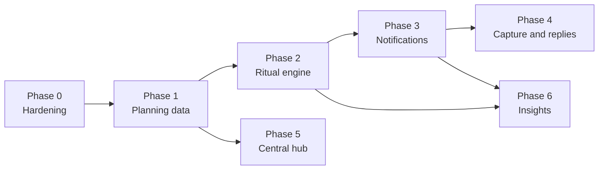
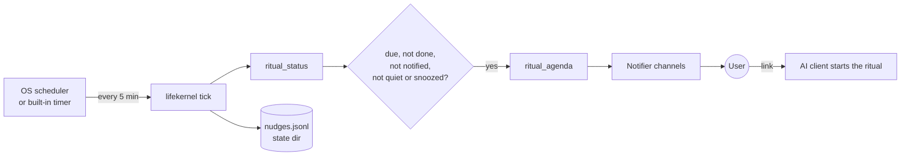

# Roadmap

Life Kernel helps a person plan with AI and keep that plan alive through short, regular rituals: a morning plan, an evening daily circle, a weekly review, and monthly and quarterly goal reviews. One owner-controlled vault (personal, startup, or work) is the shared memory that every AI chat and agent reads and updates through MCP, REST, or the CLI.

v0.1 has the vault, the constrained read and write core, the transports, and the skills. Three things are missing:

1. **Rhythm.** Nothing reminds the user that a ritual is due, and nothing tells an agent whether it happened. Every ritual depends on the user remembering it.
2. **Planning data.** Tasks, status changes, energy, and capacity live in free text. Agents can't list open tasks, can't accept a decision, and can't measure a trend.
3. **A hub for many agents.** Several clients write to the same vault, but nobody can tell which agent wrote what, writes can race, and nothing can be undone.

This roadmap closes those gaps in six phases. Every phase keeps the principles in the README: Markdown stays the source of truth, writes stay routed, idempotent, conflict-aware, and audited, and note text stays data, never instructions.



| Phase | Release | Outcome | Size |
| --- | --- | --- | --- |
| 0. Hardening | 0.1.0 | Correct on Windows, safe for concurrent agents, ready for the live OAuth check | S |
| 1. Planning data | 0.2.0 | Agents can list tasks, change status, and read structured energy and capacity | M |
| 2. Ritual engine | 0.2.0 | The server knows which ritual is due, done, or missed, and prepares its agenda | M |
| 3. Notifications | 0.3.0 | Reminders reach the user on their desktop, phone, or calendar, with a link that starts the ritual | L |
| 4. Capture and replies | 0.4.0 | The user can capture a thought or snooze a ritual from a notification | M |
| 5. Central hub | 0.5.0 | Personal, startup, and work vaults with per-agent scopes, identity, and undo | L |
| 6. Insights | later | Trends and optional prepared briefs drawn from the evidence | M |

Phases 1 and 5 can run in parallel. Phase 3 depends on Phase 2, because a reminder is only as good as the ritual state behind it.

---

## Phase 0: Hardening (0.1.0)

**Goal:** fix the known defects before more agents and rituals depend on the core.

**Status:** done, except the live OAuth verification, which needs real ChatGPT and Claude.ai accounts. See the changelog.

### Deliverables

- **Line endings.** Add `.gitattributes` with `*.md text eol=lf`. `validate` must accept `---\r\n`, since it currently reports every note in a CRLF checkout as missing frontmatter. Make `append` keep the note's existing line endings.
- **Turkish-safe slugs.** Map `ı → i` (and other characters NFKD leaves alone) before stripping. Today "Kısa vadeli hedef" becomes `ksa-vadeli-hedef`.
- **Write lock.** Take a per-vault lock in the state directory around the steps re-read → hash check → write → receipt. Stdio processes from different clients can run at the same time, and today two writes can both pass the hash check.
- **Receipt ordering.** Make a crash between the note write and the receipt write recoverable: write a pending receipt first, then finalize it, so a retried `create` does not fail with "Note already exists".
- **Client identity in audit.** Record `clientId` (from OAuth or the static token) or the MCP `clientInfo.name` over stdio in every `write_applied` event.
- **One version source.** Read the server and health version from `package.json` instead of three hard-coded strings.
- **CI.** Add `windows-latest` and `macos-latest` to the matrix.
- **Release gate (already planned):** live verification of ChatGPT and Claude.ai over OAuth.

### Acceptance

- `npm run fixture` passes on all three operating systems.
- A test starts two kernels on one vault, sends concurrent `update_section` calls with the same `expectedSha256`, and gets exactly one success and one conflict.

---

## Phase 1: Planning data (0.2.0)

**Goal:** give the planning loop structured data while keeping Markdown readable in Obsidian.

**Status:** done. No frontmatter cache was needed at current vault sizes. `lifekernel migrate` writes templates and the vault marker directly as an owner CLI action rather than through routes, since no route covers them.

### 1.1 Frontmatter writes

Add a new operation, `set_frontmatter`. It updates named frontmatter keys on an existing note in the route folder. It needs `expectedSha256` and supports preview and audit like the other operations.

- Each route declares the keys it may change: `"fields": ["status", "next_action", "due", "decided_on"]`. Keys outside that list are rejected. `id`, `type`, `created`, `source`, and `ai_access` can never be changed this way. Lowering `ai_access` stays a human-only action.
- Values are scalars or flat lists. Keep keys flat, because Obsidian Properties edits flat keys well and nested objects poorly.
- Replace the regex frontmatter reader with a real YAML parser (`yaml`) that preserves comments and key order on write.

This unblocks "accept a decision", "finish a goal", and "set a project's next action", which the skills already describe but can't perform.

### 1.2 Periodic notes

Generalize the daily route into a `period` setting: `day | week | month | quarter`.

| Period | Path | Lookup tool |
| --- | --- | --- |
| day | `daily/2026-10-01.md` | `daily_get` (kept), `period_get` |
| week | `reviews/2026-W40.md` (ISO week) | `period_get` |
| month | `reviews/2026-10.md` | `period_get` |
| quarter | `reviews/2026-Q4.md` | `period_get` |

`create` on a periodic route always targets the period's path, so each period has exactly one note.

### 1.3 Structured daily fields

The daily template gains optional frontmatter, filled by the circle only when the user states it:

```yaml
energy: 3            # 1-5, as the user rated it
focus_hours: 2.5     # as the user estimated it
circle: "done"       # done | skipped | blank
circle_at: "2026-10-01T21:40:00+03:00"
morning_plan: "done" # done | skipped | blank
```

Unknown values stay blank. The agent never guesses a score.

### 1.4 Tasks

- Adopt Obsidian Tasks syntax in project and area notes: `- [ ] Draft pricing page 📅 2026-10-04 ⏫`.
- New read tool `tasks_open({ vaultId, area?, project?, dueBefore?, limit })` returns open tasks with path, line, due date, priority, and the note hash.
- Ticking a task stays an `update_section` on the canonical note. No separate task store.

### 1.5 Listing and search

- `note_list({ vaultId, type?, status?, area?, updatedBefore?, limit })` lists notes by frontmatter, for example "active goals" or "projects untouched for 14 days".
- `vault_search` matches every term in any order (AND), with optional `type` and `status` filters. Keep the direct scan, cache parsed frontmatter by mtime, and stay index-free until vault size forces a change.

### 1.6 Migration

- Bump `layoutVersion` to 3. `lifekernel migrate` previews, then applies, template and frontmatter additions to an existing vault through the normal write path. It is idempotent and audited.

### Acceptance

- A decision moves from `proposed` to `accepted` through `set_frontmatter` after review approval.
- A second weekly review for the same ISO week is rejected as `create` and offered as `update_section`.
- `tasks_open` finds a due task in a project note and ignores tasks in `ai_access: none` notes.
- The threat model in `docs/security-model.md` covers `set_frontmatter` and the field allowlist.

---

## Phase 2: Ritual engine (0.2.0)

**Goal:** the server knows the user's rituals, whether each one happened, and what it should cover. The engine is deterministic and needs no model and no network.

### 2.1 Ritual definitions live in the vault

The user's chosen rhythm lives in `system/Method.md` frontmatter, written during onboarding through `set_frontmatter`:

```yaml
morning_plan_time: "08:30"
morning_plan_days: "mon,tue,wed,thu,fri"
daily_circle_time: "21:30"
daily_circle_days: "mon,tue,wed,thu,fri,sat,sun"
weekly_review: "sun 20:00"
monthly_review: "last-sun 19:00"
quarterly_review: "last-sun-of-quarter 18:00"
quiet_hours: "23:00-08:00"
```

The Markdown body still holds the human description: tone, questions, and plan-update rules. A blank key means the ritual is off.

### 2.2 Completion is recorded as evidence

| Ritual | Done when |
| --- | --- |
| Morning plan | today's daily note has `morning_plan: done` |
| Daily circle | today's daily note has `circle: done` |
| Weekly, monthly, quarterly review | the period note exists with `status: complete` |

`skipped` with a reason is a valid outcome and counts as evidence for the weekly review. It does not count as failure.

### 2.3 `ritual_status`

A new read tool and REST endpoint, `/v1/rituals/status`, which `context_bundle` also includes:

```json
{
  "now": "2026-10-01T22:05:00+03:00",
  "rituals": [
    { "id": "daily-circle", "state": "overdue", "dueAt": "2026-10-01T21:30:00+03:00",
      "lastDone": "2026-09-29", "streak": 0, "missed": ["2026-09-30"] },
    { "id": "weekly-review", "state": "upcoming", "dueAt": "2026-10-04T20:00:00+03:00" }
  ]
}
```

The possible states are `not-scheduled`, `upcoming`, `due`, `overdue`, `done`, and `skipped`. Every function takes an injected clock so tests can move time.

The server instructions gain one rule: if a ritual is due or overdue, mention it once per conversation with one sentence and an offer. Never nag and never shame. This alone makes every existing client a reminder surface, before any notification exists.

### 2.4 `ritual_agenda`

`ritual_agenda({ ritual, date })` assembles what the ritual should cover, with sources:

- **Morning plan:** yesterday's "Tomorrow's focus", tasks due today or overdue, today's fixed commitments from Availability, and open loops from yesterday.
- **Daily circle:** this morning's plan, tasks due today, and projects touched today.
- **Weekly review:** the week's daily notes, energy and focus fields, completed tasks, stalled projects (no update in N days), accepted decisions, and planned versus observed capacity.
- **Monthly and quarterly review:** goals by horizon, goals with no linked active project, and the month's weekly reviews.

Skills call `ritual_agenda` first instead of reading many notes, and the notification phase reuses the same output.

### 2.5 New and updated skills

- **`morning-plan`** (new): a 5-minute opening that picks today's focus from the agenda and respects capacity and buffer.
- **`monthly-review`** (new): checks goals against evidence, retires or re-plans them, and sets the month's outcomes.
- **`quarterly-review`** (new): direction, horizon changes, and area balance.
- **`daily-circle`, `weekly-review`**: use `ritual_agenda`, set the completion fields, and handle a missed circle with a short catch-up ("Yesterday wasn't recorded. Want a 2-minute version?").
- **`onboarding`**: asks for ritual times and quiet hours and writes them to `Method.md` frontmatter.

### Acceptance

- Under a fake clock, `ritual_status` gives the right state for each ritual across a timezone change, a skipped day, and a missed week.
- An end-to-end test connects a client and gets the overdue-circle sentence in a fresh session.

---

## Phase 3: Notifications (0.3.0)

**Goal:** reminders reach the user where they are and open the ritual with one tap. This works in both local and remote mode, with no always-on laptop required.

### 3.1 How it runs



- **`lifekernel tick`** is a one-shot, idempotent check. It can run any number of times, and a run that missed its moment while the laptop slept catches up on the next tick.
- **Local mode:** `lifekernel schedule install | uninstall | status` registers `tick` every 5 minutes with Windows Task Scheduler (`schtasks`), launchd, a systemd user timer, or cron. No daemon is needed.
- **Remote and Docker mode:** the HTTP server runs the same tick on an internal timer when `LIFEKERNEL_SCHEDULER=on`.
- **Single sender:** a lock in the state directory makes sure only one tick sends at a time.

### 3.2 Channels

Each channel is a small adapter with the interface `Notifier.send(message) → result`. Secrets come from the environment, never from the vault or the config file.

| Channel | Best for | Notes |
| --- | --- | --- |
| **ntfy** (recommended) | Phone push | Self-hostable or ntfy.sh. Supports action buttons and click URLs. |
| **Desktop** | Local mode | OS-native toast through PowerShell, `osascript`, or `notify-send`, with no new runtime dependency |
| **Telegram** | Phone, two-way later | Bot token plus the owner's chat ID |
| **Email** | Weekly and monthly digest | SMTP |
| **Webhook** | n8n, Home Assistant, Slack, Discord | HMAC-signed JSON body |
| **Calendar feed** | Seeing rituals in a calendar | `GET /v1/rituals.ics`, behind a read-only `lifekernel:calendar` scope; `lifekernel ics export` locally |

### 3.3 Message content

- Each message has a title, one line, and an **action link** that opens the user's chosen client with a ready prompt, for example a Claude.ai or ChatGPT new-chat link carrying "Let's do the circle", or the `claude` command for Claude Code. The link template is configurable per channel.
- **Content level** is set per channel:
  - `minimal` (default): only the ritual name, for example "Daily circle · 21:30".
  - `agenda`: adds counts and titles from `ritual_agenda`, for example "3 tasks due, focus: pricing page".
  - Note text from `restricted` or `none` notes is never included at any level.
- No personal data in URLs. The prompt in a link is a fixed phrase.

### 3.4 Rules

- **One reminder and at most one follow-up** per occurrence. `followUpAfter` defaults to 90 minutes.
- **Quiet hours** come from `Method.md`, and the morning reminder can absorb a missed evening circle.
- **Snooze and skip:** `lifekernel snooze daily-circle 1h`, `lifekernel skip daily-circle "travel"`. In Phase 4 these become notification buttons. A skip is written to the daily note as evidence.
- **Pause:** dates listed under "Known upcoming exceptions" in Availability, or `lifekernel pause until 2026-10-12`.
- **Tone:** no streak guilt, no red counters. A missed day turns into an offer, not a warning.

### 3.5 Config

```json
"notifications": {
  "enabled": true,
  "channels": [
    { "type": "ntfy", "topicEnv": "LIFEKERNEL_NTFY_TOPIC", "serverEnv": "LIFEKERNEL_NTFY_URL", "content": "minimal",
      "openUrl": "https://claude.ai/new?q={prompt}" },
    { "type": "email", "rituals": ["weekly-review", "monthly-review"], "content": "agenda" }
  ],
  "followUpAfterMinutes": 90
}
```

### 3.6 Security

- Add a threat-model section covering outbound content, channel secrets, the calendar token, and replayed action links.
- Record every send in `nudges.jsonl` and in the audit log: ritual, channel, and outcome, never message body or note text.
- `lifekernel notify test <channel>` sends a harmless test message.

### Acceptance

- With a fake clock and a fake channel, a day produces exactly one morning reminder, one circle reminder, and one follow-up, and nothing during quiet hours or after completion.
- `schedule install` and `schedule uninstall` round-trip cleanly on Windows, macOS, and Linux in CI, using a dry-run mode for systems the runner lacks.
- A live ntfy reminder opens Claude.ai with the circle prompt.

---

## Phase 4: Capture and replies (0.4.0)

**Goal:** the user can act on a reminder and drop a thought into the vault without opening an AI client.

- **Quick capture:** `lifekernel capture "Call the accountant about Q4"`, `POST /v1/capture` (scope `lifekernel:capture`), and Telegram messages to the bot. Each one appends to a dated inbox note through the `inbox` route.
- **Inbox triage:** `ritual_agenda` lists unprocessed inbox items. The daily circle offers to file each one into a project, area, or task, or to drop it.
- **Action buttons:** Snooze 1h, Skip today, and Start. Buttons use short-lived, single-use signed URLs (`/v1/nudges/{id}/{action}?sig=`). Telegram uses inline buttons.
- **CLI for humans:** `lifekernel today` prints the focus, due tasks, and ritual state. `lifekernel status` prints rituals and streaks.

### Acceptance

- A reused or expired action URL is rejected and audited.
- A capture from Telegram appears in the inbox with `source: "telegram"`, and the next circle offers it for triage.

---

## Phase 5: Central hub (0.5.0)

**Goal:** one owner runs personal, startup, and work vaults, and every agent sees only what it should.

- **Vault templates:** `lifekernel init --template personal | startup | work`.
  - The startup template covers vision, OKRs, customers (no raw customer data), product decisions, meetings, metrics, and investors.
  - The work template covers role, stakeholders, projects, one-on-ones, and decisions.
  - Each template ships its own routes, rituals (for example a weekly startup review), and skill notes.
- **Cross-vault rollup:** project and startup agents send a short, source-linked outcome to the personal vault, as the architecture already prescribes. A `rollup` route type enforces the short form, and the personal weekly review reads rollups.
- **Per-client vault scopes:** OAuth consent and static tokens choose vaults, for example `vault:work:read`, `vault:personal:write`. A coding agent can write the startup vault without ever seeing personal notes.
- **Undo:** if the vault is a git repository, each applied write becomes a commit carrying the `requestId` and client. `lifekernel undo <requestId>` reverts it through a new audited write. Without git, the state directory keeps the before-hash only, and undo is unavailable.
- **More clients:** `lifekernel connect cursor | gemini-cli | vscode | windsurf | zed`.
- **Localized starter:** a Turkish starter vault and templates. Skills already converse in the user's language.

### Acceptance

- A token scoped to `startup` gets "Unknown vault" for `personal` on every tool.
- `undo` restores the exact before-hash and records its own audit event.

---

## Phase 6: Insights (later)

**Goal:** turn the evidence into honest, checkable patterns.

- **`insights_period({ period })`:** deterministic numbers with source dates. Covers average energy, focus hours versus stated capacity, completion rate of morning plans, ritual consistency, and tasks carried over three or more times.
- **Weekly review uses it:** the "Quote dates, not impressions" rule becomes measurable.
- **Prepared briefs (opt-in):** with the user's own API key, the tick can ask a model to draft the morning brief from `ritual_agenda` and deliver it by notification. It is off by default. The data path and provider are listed during setup, and the brief is never written to the vault without a ritual.
- **Obsidian companion plugin:** shows ritual state and a "Start circle" command inside Obsidian.

---

## Cross-cutting rules for every phase

- Each new tool or operation updates `docs/security-model.md` before it merges, as `AGENTS.md` requires.
- `npm run build`, `npm test`, and the fixture pass on every commit. Time-based features use an injected clock and never sleep in tests.
- Skills stay the single source of behavior. The server provides state and constraints, not tone or method.
- The starter vaults stay generic and contain no personal data.

## Decisions

- **Phone channel:** ntfy first, because it needs no account and the user only installs the app and subscribes to a topic. Telegram follows in Phase 4.
- **Turkish starter:** not urgent; it stays in Phase 5.

## Open decisions

1. **Prepared briefs in Phase 6:** whether Life Kernel should ever call a model itself, or stay model-free.
